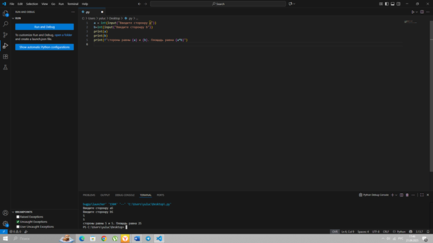

## Тема 2. Базовые операции языка Python
Отчет по теме № 2 подготовил(а):
Суслопарова Юлия
Пиэ-23-1

| Заданияе | Выполнено |
|-----------|-----------|
| 1         | +         |
| 2         | +         |
| 3         | +         |
| 4         | +         |
| 5         | +         |
| 6         | +         |
| 7         | +         |
| 8         | +         |
| 9         | +         |
| 10         | +         |

## Задание 1. 

# Выводы  
Создание булевой переменной , которая принимает значение false

## Задание 2. 

# Выводы 
Присваивание значения трем переменным и вывод их в консоль

## Задание 3. 

# Выводы 
Реализуется ввод данных в программу через консоль только в виде целых чисел

## Задание 4. 

# Выводы  
Cтрока 'abcde' повторяется 6 раз подряд через оператор умножения

## Задание 5. 

# Выводы 
Cоздаются три переменные: den со значением 21 mount со строковым значением "сентября" и yer со значением 2025 затем функция print выводит форматированную строку

## Задание 6. 

# Выводы 
Создается переменную a путем сложения трех строковых литералов: "Hello", " my " и "World"

## Задание 7. 

# Выводы 
Функция len подсчитывает количество символов в строке "Hello World" включая пробел

## Задание 8. 

# Выводы  
Метод lower преобразует все заглавные буквы строки "HELLO WORLD" в строчные и выводит результат hello world

## Задание 9. Площадь прямоугольника 

# Выводы 
Программа запрашивает у пользователя ввод двух чисел а и b преобразует введенные строки в целые числа с помощью функции int выводит каждое число отдельно а затем с помощью f-строки выводит информацию о сторонах и вычисляет площадь путем умножения a на b выводя результат в отформатированном виде.

## Задание 10. 

# Выводы 
Программа присваивает переменной a числовое значение 5 а переменной b строковое значение "нянянуню" затем с помощью функции str преобразует число a в строку и с помощью оператора сложения объединяет строку b и преобразованное значение a в результате выводится строка "нянянуню5".

